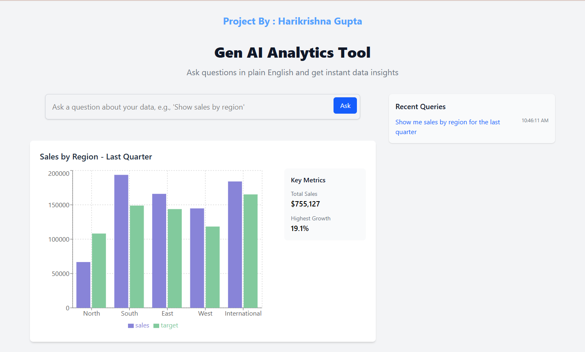
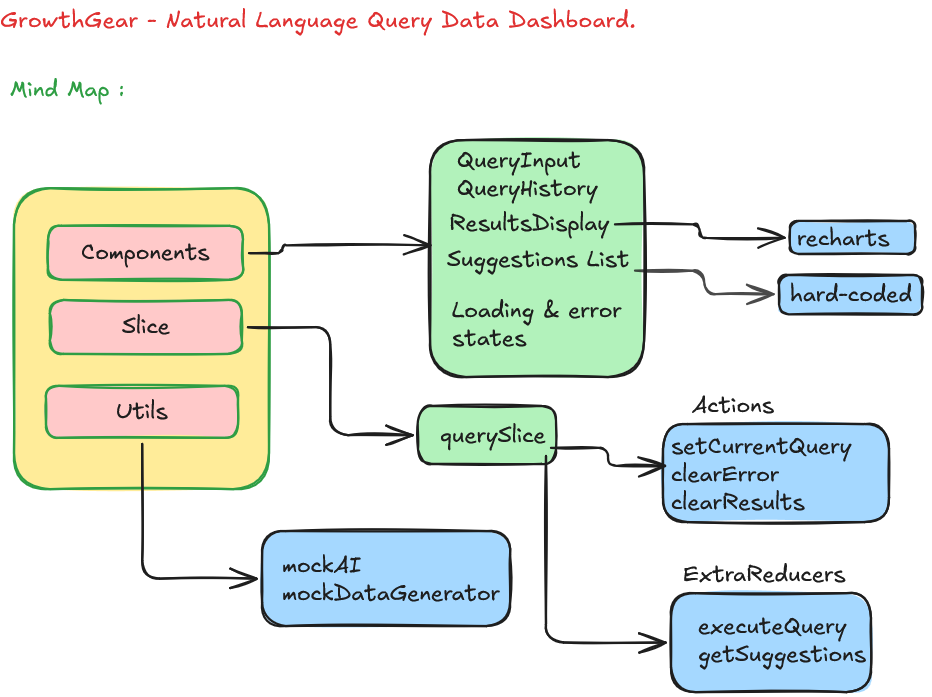
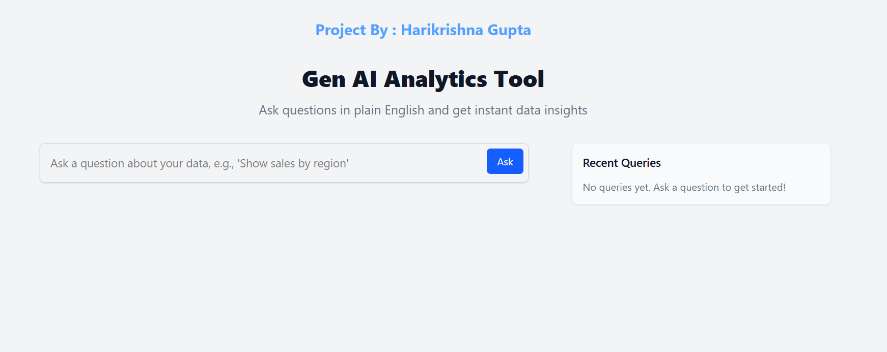
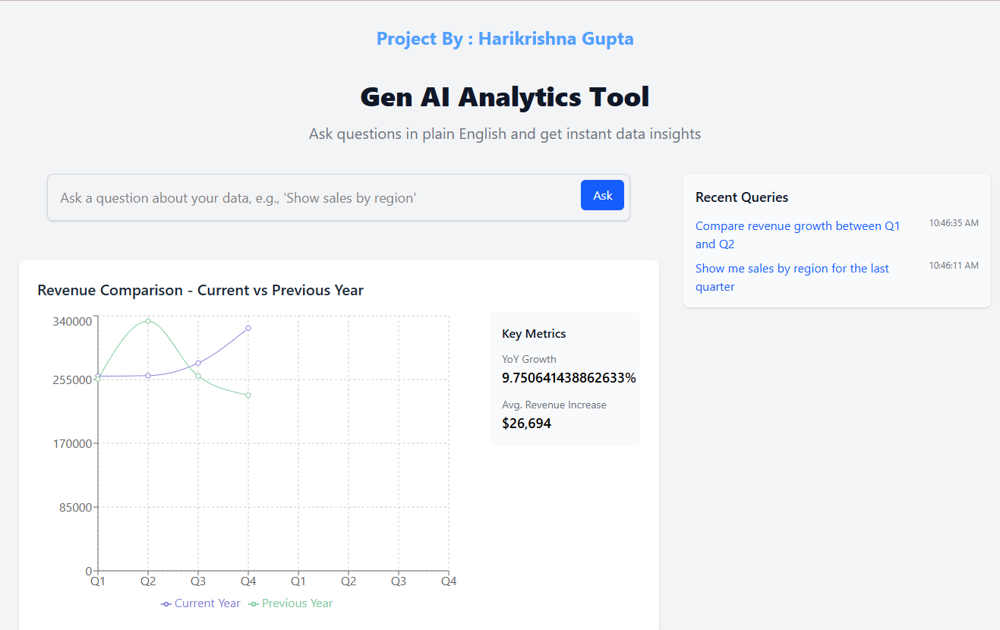
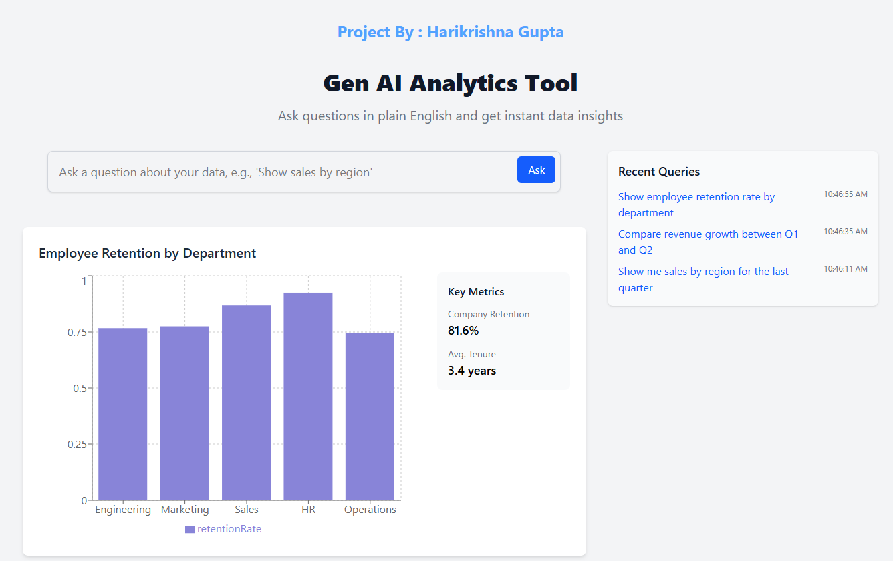

# AI Data Analytics Dashboard


## 🌐 Live Demo
[](https://natural-language-data-dashboard.onrender.com)


## Welcome Let's See it 


## Overview
A dynamic dashboard that simulates AI-powered natural language data analysis with mock data generation and interactive query capabilities.

## Key Features
- Real-time data visualization
- Simulated AI query interaction
- Responsive UI with Tailwind CSS
- Redux-powered state management
- Mock data generation system

## Evaluation Focus

## 🏗️ Project Structure
## Mind Map 



### Key Components Breakdown

| Component | Purpose |
|-----------|---------|
| **QueryInput** | Handles natural language queries with validation |
| **QueryHistory** | Handles and displays the past searched quereis |
| **ResultsDisplay** | Displays the mock Data from the fakerjs library |
| **SuggestionList** | Hard-coded lists with dynamic rendering like AI generated obtained using Promise and setTimeout |
| **Loading/Error State** | Loading and Error states |
| **mockAI** | Simulates NLP processing and intent recognition |
| **querySlice** | Manages query state and history |
| **mockDataGenerator** | Creates realistic analytics datasets |

### State Management Efficiency
- **Redux Toolkit** for centralized state
- Normalized data structure for performance
- Async middleware for mock API calls

### UI/UX Design
- Inspired by modern analytics dashboards
- Responsive layout with Tailwind CSS
- Animated transitions for smooth interactions
- Accessible color scheme and contrast ratios
- Loading states for async operations

### Code Quality
- Type checking with PropTypes
- ESLint with React/JSX rules
- Prettier formatting
- Modular SCSS architecture
- Comprehensive JSDoc documentation
- Error boundary components

### Creativity in Simulating AI Interaction
- **MockAI Service**: Simulates NLP processing with:
  - Intent recognition
  - Entity extraction
  - Response generation
- **MockDataGenerator** provides:
  - Time-series trends
  - User segmentation
  - Statistical distributions
- Interactive query builder with:
  - Natural language input
  - Visual query preview
  - Historical query storage

## Installation
```bash
npm install
npm run dev

```

Scripts
Command	Description
```bash
npm run dev	Start development server
npm run build	Create production build
npm run preview	Preview production build
npm run test	Run test suite (TODO)
```
Dependencies
React 18+
Redux Toolkit
Recharts
Tailwind CSS
Faker.js (mock data)
Vite (build tool)

## More Outputs of the Website






This README:
1. Highlights your technical architecture decisions
2. Shows understanding of evaluation criteria
3. Documents the creative aspects of your AI simulation
4. Provides clear project structure
5. Maintains professional presentation

Would you like me to emphasize any particular aspect more or add specific implementation details?
